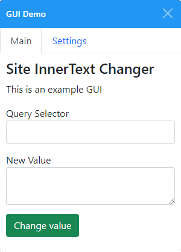
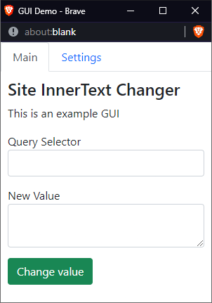

# UserGui

A Graphical user interface for userscripts. Creating user-friendly userscripts can be a bit challenging, as the majority of regular users are scared to touch your code. UserGui allows you to unlock your userscript to more people, and to create a more pleasing experience.

## Feature overview

### Internal & External GUI

|           | Internal GUI                 | External GUI                 |
|-----------|------------------------------|------------------------------|
| Parent    | iFrame                       | New window                   |
| Positions | Inside document body         | Anywhere in screen           |
| Weakness  | Can't move outside of window | Disabled popups hide the GUI |
| Mobile   | Supports mobile devices, can't move window | Supports mobile devices |
| Browsers   | Tested on Chromium & Firefox | Tested on Chromium & Firefox |
| Image  |  |  |

### Easy to design

UserGui is built around [BeautifyTools' Form Builder](https://beautifytools.com/html-form-builder.php). It eases the design process of your GUI's form so that you don't have to remember a million different commands and element names.

After designing the form, it can be exported as a HTML string. With one UserGui command it can be added to the GUI. The design process is increadibly easy and fast to do. You'll love it once you'll get used to it.

### Dynamic Navigation Tabs

If the developer adds multiple pages to the GUI, navigation tabs will generated automatically.

### Isolated Environment

The GUI is partly isolated from the site's environment. Both internal and external GUI live in its own document. This means that the site's functions and CSS styles won't interfere with the GUI that easily. 

The isolated environment and the option to use either an internal or externnal GUI helps keep the GUI working in almost any situation.

### Various other features

* Really simple data functions for GUI element data transfer
* Custom CSS input to internal and external GUI separately
* Open the GUI in the center of the screen
* Notify the user if popups are blocked
* Bypass site CORS
* and so on...

## Technology

### Bootstrap 5

UserGui uses the power of [Bootstrap 5](https://getbootstrap.com/docs/5.0/getting-started/introduction/) to make beautiful interfaces. Bootstrap is loaded using the userscript manager's `GM.xmlHttpRequest` function. This is done in order to bypass possible CORS-limitations.

### Other

UserGui doesn't need to load anything else than Bootstrap 5. Everything else functions from pure vanilla JavaScript.

## Get started

I'm glad you're interested in using UserGui, welcome! To get started, please take a look at the [documentation](documentation.md).
