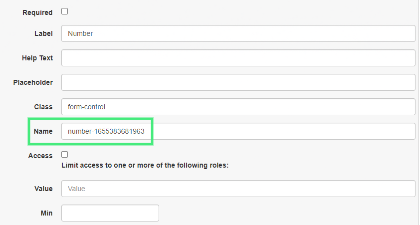

# UserGui Documentation


- [Quick Start](#quick-start)
- [Important Parameter](#important-parameter)
- [Public Functions](#public-functions)
    - [General GUI Functions](#general-gui-functions)   
    - [Event Functions](#event-functions)
    - [Form Modification Functions](#form-modification-functions)
    - [GUI Data Transfer Functions](#gui-data-transfer-functions)
- [Public Variables](#public-variables)
    - [Window](#window-object)
    - [Document](#document-object)
    - [iFrame](#iframe-object)
    - [Settings](#settings-object)

## Quick Start

### 1) Setup the userscript header

Grant the userscript `GM_xmlhttpRequest`, `GM_getValue`, `GM_setValue` and require the UserGui, like so.

```js
// @grant       GM_getValue
// @grant       GM_setValue
// @grant       GM_xmlhttpRequest
// @require     https://github.com/AugmentedWeb/UserGui/releases/download/v1.0.0/usergui.js
```

### 2) Create a new instance

```js
const Gui = new UserGui;
```

### 3) Apply settings

`Gui.settings` has configuration options for the GUI and its window, such as.

```js
Gui.settings.window.title = "GUI Demo"; // set window title
Gui.settings.window.centered = true; // GUI starts at the center of the screen
Gui.settings.gui.internal.darkCloseButton = true; // Changes the close button to dark theme
```

[Learn more about the settings](#settings-object)

### 4) Add a page

Use [BeautifyTools' Form Builder](https://beautifytools.com/html-form-builder.php) to create your GUI elements. After designing the form, press the "Get HTML" button. 

> **NOTE: Other form builders are not supported, please only use the BeautifyTool's form builder.**

Insert the form's HTML string, **as a whole**, into the `Gui.addPage(tabName, htmlString)` function's @htmlString parameter, like so.

```js
Gui.addPage("Some tab name", `
<div class="rendered-form">
    <div class="formbuilder-button form-group field-button-1655324182259">
        <button type="button" class="btn-default btn" name="button-1655324182259" access="false" style="default" id="button-1655324182259">Button</button>
    </div>
</div>
`);
```

[Learn more about addPage function](#addpage-function)

### 5) Open the GUI

Use `Gui.open(readyFunction)` to open the GUI.

```js
Gui.open(() => {
    // learn more in step 6
});
```

[Learn more about open function](#open-function)

### 6) Functionalize the GUI

Currently, your GUI is a dead shell. We need to add event listeners to make it alive.

Inside the `Gui.open(readyFunction)`'s ready function, add events using `event(name, event, eventFunction)`, like so.

```js
Gui.open(() => {
    Gui.event("button-1655324182259", "click", () => {
        console.log("Button was clicked!");
    });
});
```

[Learn more about event function](#event-function)

In this example, since our @name parameter "button-1655324182259" has the type prefix "button-", we can use a simplified function `smartEvent(name, eventFunction)` to achieve the same thing. The [BeautifyTools' Form Builder](https://beautifytools.com/html-form-builder.php) has the prefix in the name as default, please don't change it if you want to use the smartEvent function.

[Learn more about the name parameter](#important-parameter)

```js
Gui.open(() => {
    Gui.smartEvent("button-1655324182259", () => {
        console.log("Button was clicked!");
    });
});
```

[Learn more about smartEvent function](#smartevent-function)

### 7) The GUI is done

The final result could look like this,

```js
// ==UserScript==
// @name        Example-GUI
// @namespace   HKR
// @match       https://example.com/*
// @grant       GM_setValue
// @grant       GM_getValue
// @grant       GM_xmlhttpRequest
// @version     1.0
// @author      HKR
// @description This is an example userscript made for UserGui
// @require     https://github.com/AugmentedWeb/UserGui/releases/download/v1.0.0/usergui.js
// ==/UserScript==

const Gui = new UserGui;

Gui.settings.window.title = "GUI Demo"; // set window title
Gui.settings.window.centered = true; // GUI starts at the center of the screen
Gui.settings.window.external = true; // GUI opens up externally

Gui.addPage("Some tab name", `
<div class="rendered-form">
    <div class="formbuilder-button form-group field-button-1655324182259">
        <button type="button" class="btn-default btn" name="button-1655324182259" access="false" style="default" id="button-1655324182259">Button</button>
    </div>
</div>
`);

Gui.open(() => {
    Gui.smartEvent("button-1655324182259", () => {
        console.log("Button was clicked!");
    });
});
```

[More userscript examples](examples)

# Important Parameter

UserGui has one parameter that you have to know if you want to achieve greatness. That's the `name` parameter which you see on almost every function. It allows UserGui to locate the form element of your choosing, and traverse trough its elements.

### How do I get it?

Using the [BeautifyTools' Form Builder](https://beautifytools.com/html-form-builder.php), hover over your form element, and click on the pencil to edit the element. The menu that slides down has the name variable. That's what you're going to use when the function asks for a `name` parameter!



It's also visible on your form element's HTML, like in this "Date Field" `date-1655383407790`. How many can you spot?

```html
<div class="formbuilder-date form-group field-date-1655383407790">
    <label for="date-1655383407790" class="formbuilder-date-label">Date Field</label>
    <input type="date" class="form-control" name="date-1655383407790" access="false" id="date-1655383407790">
</div>
```

If you answered 4, that's correct!

# Public Functions

## General GUI Functions

### AddPage Function

```js
addPage(tabName, htmlString)
```
>
> ### Description
>
> Adds a page object to the GUI page array. This function is used to add form content to the GUI. If multiple pages are added, a navigation bar will automatically be generated.
>
> ### Parameters
>
> **@tabName (String)** *Navigation bar tab's title*
>
> **@htmlString (String)** *HTML form content taken from BeautifyTools' Form Builder*
>
> ### Returns
>
> None

### Open Function

```js
open(readyFunction)
```
>
> ### Description
>
> Opens the GUI. Done either externally via a new window, or internally via iFrame.
>
> ### Parameters
>
> **@readyFunction (Function)** *Gets called after the GUI has initialized. Might contain user's event functions to functionalize the GUI.*
>
> ### Returns
>
> None

### Close Function

```js
close()
```
>
> ### Description
>
> Closes the GUI. Externally, `window.close()` is called. Internally, the whole iFrame will be removed.
>
> ### Parameters
>
> None
>
> ### Returns
>
> None

### Save Function

```js
saveConfig()
```
>
> ### Description
>
> Saves the current GUI form element's values.
>
> ### Parameters
>
> None
>
> ### Returns
>
> None

### Load Function

```js
loadConfig()
```
>
> ### Description
>
> Loads the saved GUI form element's values.
>
> ### Parameters
>
> None
>
> ### Returns
>
> None

### GetConfig Function

```js
getConfig()
```
>
> ### Description
>
> Gets the config from the userscript manager's storage.
>
> ### Parameters
>
> None
>
> ### Returns
>
> **(Array)** *The saved GUI config as an object array. The objects contain a form element's name and value.*

### GetConfig Function

```js
resetConfig()
```
>
> ### Description
>
> Resets the config. The array of stored values will be wiped.
>
> ### Parameters
>
> None
>
> ### Returns
>
> None
> 
### DispatchFormEvent Function

```js
dispatchFormEvent(name)
```
>
> ### Description
>
> Dispatches an event on a GUI form element
>
> ### Parameters
>
> **@name (String)** *[Form element's name, taken from BeautifyTools' Form Builder](#important-parameter)*
>
> ### Returns
>
> None

### SetPrimaryColor Function

```js
setPrimaryColor(hex)
```
>
> ### Description
>
> Changes the GUI Header's, Navbar's and Bootstrap's primary text's color
>
> ### Parameters
>
> **@hex (String)** *A hex color code*
>
> ### Returns
>
> None

## Event Functions

### Event Function

```js
event(name, event, eventFunction)
```
>
> ### Description
>
> Creates an event listener for a GUI form element.
>
> ### Parameters
>
> **@name (String)** *[Form element's name, taken from BeautifyTools' Form Builder](#important-parameter)*
> 
> **@event (String)** *Event to listen for (e.g. click, change)*
> 
> **@eventFunction (Function)** *Function to be called when event is activated*
> 
> ### Returns
>
> None

### SmartEvent Function

```js
smartEvent(name, eventFunction)
```
>
> ### Description
>
> Creates an event listener for a GUI form element, but automatically determines the best listener type for the element. Requires the name parameter to have the type as a prefix (e.g. "button-", "select-"). An example name could be `select-1655377908386`, or `textbox-cool-text`.
> 
> - "Button" -> listen for "click"
> 
> - "Textarea" -> listen for "input"
> 
> - e.g.
> 
> ### Parameters
>
> **@name (String)** *[Form element's name, taken from BeautifyTools' Form Builder](#important-parameter). Has to have the type prefix (e.g. "button-", "select-")*
>
> **@eventFunction (Function)** *Function to be called when event is activated*
> 
> ### Returns
>
> None

## Form Modification Functions

### Disable Function

```js
disable(name)
```
>
> ### Description
>
> Disables a GUI form element.
>
> ### Parameters
>
> **@name (String)** *[Form element's name, taken from BeautifyTools' Form Builder](#important-parameter)*
> 
> ### Returns
>
> None

### Enable Function

```js
enable(name)
```
>
> ### Description
>
> Enables a GUI form element.
>
> ### Parameters
>
> **@name (String)** *[Form element's name, taken from BeautifyTools' Form Builder](#important-parameter)*
> 
> ### Returns
>
> None

## GUI Data Transfer Functions

### GetValue Function

```js
getValue(name)
```
>
> ### Description
>
> Gets a GUI form element's value. Works on types "Text Field", "Textarea", "Date Field" & "Number".
>
> ### Parameters
>
> **@name (String)** *[Form element's name, taken from BeautifyTools' Form Builder](#important-parameter)*
> 
> ### Returns
>
> **(String, Integer)** *The GUI form element's value*

### SetValue Function

```js
setValue(name, newValue)
```
>
> ### Description
>
> Sets a GUI form element's value. Works on types "Text Field", "Textarea", "Date Field" & "Number".
>
> ### Parameters
>
> **@name (String)** *[Form element's name, taken from BeautifyTools' Form Builder](#important-parameter)*
> 
> **@newValue (String, Integer)** *The new GUI form element's value to be set*
> 
> ### Returns
>
> None

### GetSelection Function

```js
getSelection(name)
```
>
> ### Description
>
> Gets a GUI form element's selected option's value. Works on type "Radio Group".
>
> ### Parameters
>
> **@name (String)** *[Form element's name, taken from BeautifyTools' Form Builder](#important-parameter)*
> 
> ### Returns
>
> **(String, Integer)** *The GUI form element's selected option's value*

### SetSelection Function

```js
setSelection(name, newOptionsValue) 
```
>
> ### Description
>
> Selects a GUI form element's option. Works on type "Radio Group".
>
> ### Parameters
>
> **@name (String)** *[Form element's name, taken from BeautifyTools' Form Builder](#important-parameter)*
> 
> **@newOptionsValue (String, Integer)** *The GUI form element's option's value, which will be checked*
> 
> ### Returns
>
> None

### GetChecked Function

```js
getChecked(name)
```
>
> ### Description
>
> Gets a GUI form element's all checked options' values. Works on type "Checkbox Group".
>
> ### Parameters
>
> **@name (String)** *[Form element's name, taken from BeautifyTools' Form Builder](#important-parameter)*
> 
> ### Returns
>
> **(Array)** *Array of a GUI form element's checked options' values*

### SetChecked Function

```js
setChecked(name, checkedArr)
```
>
> ### Description
>
> Sets a GUI form element's checked options. Works on type "Checkbox Group".
>
> ### Parameters
>
> **@name (String)** *[Form element's name, taken from BeautifyTools' Form Builder](#important-parameter)*
>
> **@checkedArr (Array)** *String array of the value's to be checked*
> 
> ### Returns
>
> None

### GetFiles Function

```js
getFiles(name)
```
>
> ### Description
>
> Gets a GUI form element's files. Works on type "File Upload".
>
> ### Parameters
>
> **@name (String)** *[Form element's name, taken from BeautifyTools' Form Builder](#important-parameter)*
> 
> ### Returns
>
> **(Object)** *Object containing the files and additional information (e.g `FileList {0: File, length: 1}`)*

### GetOption Function

```js
getOption(name) 
```
>
> ### Description
>
> Gets a GUI form element's selected option's value. Works on type "Select".
>
> ### Parameters
>
> **@name (String)** *[Form element's name, taken from BeautifyTools' Form Builder](#important-parameter)*
> 
> ### Returns
>
> **(String, Integer)** *The GUI form element's selected option's value*

### SetOption Function

```js
setOption(name, newOptionsValue)
```
>
> ### Description
>
> Sets a GUI form element's selected option. Works on type "Select".
>
> ### Parameters
>
> **@name (String)** *[Form element's name, taken from BeautifyTools' Form Builder](#important-parameter)*
>
> **@newOptionsValue (String, Integer)** *The GUI form element's option's value to be selected*
> 
> ### Returns
>
> None

### GetData Function

```js
getData(name)
```
>
> ### Description
>
> Automatically determines the suitable "*get*" function for a GUI form element. Requires the name parameter to have the type as a prefix (e.g. "button-", "select-"). An example name could be `select-1655377908386`, or `textbox-cool-text`.
>
> - "Checkbox Group" -> use `getChecked(name)`
> 
> - e.g.
> 
> ### Parameters
>
> **@name (String)** *[Form element's name, taken from BeautifyTools' Form Builder](#important-parameter). Has to have the type prefix (e.g. "button-", "select-")*
> 
> ### Returns
>
> **(String, Integer, Array, Object)** *The GUI form element's data (e.g. element's value, element's selected values)*

### SetData Function

```js
setData(name, newData)
```
>
> ### Description
>
> Automatically determines the suitable "*set*" function for a GUI form element. Requires the name parameter to have the type as a prefix (e.g. "button-", "select-"). An example name could be `select-1655377908386`, or `textbox-cool-text`.
>
> - "Checkbox Group" -> use `setChecked(name)`
> 
> - e.g.
> 
> ### Parameters
>
> **@name (String)** *[Form element's name, taken from BeautifyTools' Form Builder](#important-parameter). Has to have the type prefix (e.g. "button-", "select-")*
>
> **@newData (String, Integer, Array)** *The GUI form element's new data (e.g. new values, new selected options)*
> 
> ### Returns
>
> None

# Public Variables

### Window Object

```js
const Gui = new UserGui;
Gui.window
```
>
> ### Description
>
> Contains the window element. Use this variable to access the GUI's window. It will always be seperate from the site's window.

### Document Object

```js
const Gui = new UserGui;
Gui.document
```
>
> ### Description
>
> Contains the document element. Use this variable to access the GUI's document. It will always be seperate from the site's document.

### iFrame Object

```js
const Gui = new UserGui;
Gui.iFrame
```
>
> ### Description
>
> Contains the iFrame element. If the GUI is internal, use this variable to access the GUI's iFrame.

### Settings Object

```js
{
    "window" : {
        "title" : "No title set",
        "name" : "userscript-gui",
        "external" : false,
        "centered" : false,
        "size" : {
            "width" : 300,
            "height" : 500,
            "dynamicSize" : true
        }
    },
    "gui" : {
        "centeredItems" : false,
        "internal" : {
            "darkCloseButton" : false,
            "style" : `[...]`
        },
        "external" : {
            "popup" : true,
            "style" : `[...]`
        }
    },
    "messages" : {
        "blockedPopups" : () => alert(`[...]`)
    }
}
```

```js
const Gui = new UserGui;
Gui.settings
```
>
> ### Description
>
> Contains the settings for the GUI window and the GUI itself.
